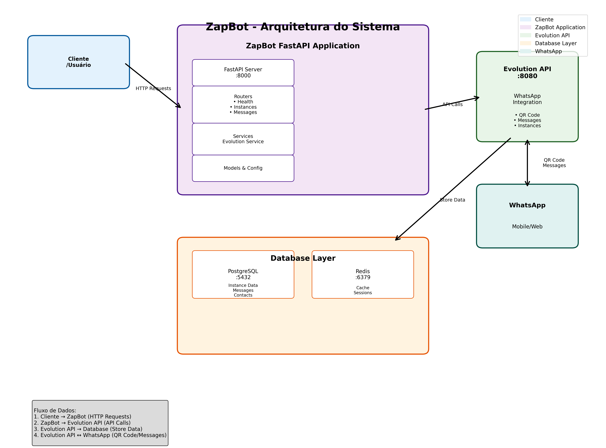

# zapbot
Projeto bot com zapIA Master

## Arquitetura



Para mais detalhes sobre a arquitetura, consulte:
- [Documentação da Arquitetura](docs/arquitetura.md)
- [Diagrama ASCII](docs/arquitetura_ascii.txt)

## Serviços

O projeto utiliza os seguintes serviços:

- **PostgreSQL**: Banco de dados principal
- **Redis**: Cache e sessões
- **Evolution API**: API para integração com WhatsApp

## Como executar

1. Clone o repositório
2. Copie o arquivo de exemplo de variáveis de ambiente:
```bash
cp env.example .env
```

3. Edite o arquivo `.env` com suas configurações (opcional)

4. Execute o docker-compose:
```bash
docker-compose up -d
```

5. Acesse o Evolution API em: http://localhost:8080

## Evolution API

O Evolution API está configurado para:
- Porta: 8080
- API Key: `evolution_api_key_123`
- Integração com PostgreSQL e Redis
- Webhooks habilitados
- WebSocket para eventos em tempo real

### Configuração do WhatsApp

1. Acesse http://localhost:8080
2. Crie uma nova instância
3. Escaneie o QR Code com seu WhatsApp


