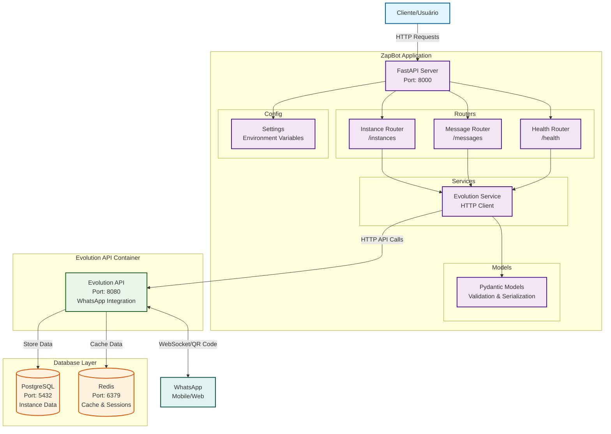

# Arquitetura do ZapBot

## Diagrama da Arquitetura

## Componentes da Arquitetura

### 1. ZapBot FastAPI Application
- **FastAPI Server**: Servidor principal da aplicação (porta 8000)
- **Routers**: Módulos organizados por funcionalidade
  - Health Router: Monitoramento e status da aplicação
  - Instance Router: Gerenciamento de instâncias do WhatsApp
  - Message Router: Envio de mensagens
- **Services**: Camada de serviços para integração externa
  - Evolution Service: Cliente HTTP para comunicação com Evolution API
- **Models**: Modelos Pydantic para validação e serialização
- **Config**: Configurações da aplicação via variáveis de ambiente

### 2. Evolution API
- **Container**: Aplicação Evolution API (porta 8080)
- **Funcionalidades**: 
  - Integração com WhatsApp via Baileys
  - Gerenciamento de instâncias
  - Geração de QR Codes
  - Envio e recebimento de mensagens

### 3. Database Layer
- **PostgreSQL**: Banco de dados principal para persistência
  - Dados das instâncias
  - Histórico de mensagens
  - Contatos e chats
- **Redis**: Cache e gerenciamento de sessões
  - Cache de instâncias
  - Sessões temporárias
  - Dados de performance

### 4. Fluxo de Dados
1. Cliente faz requisições HTTP para o ZapBot
2. ZapBot processa via routers específicos
3. Services fazem chamadas para Evolution API
4. Evolution API gerencia conexões WhatsApp
5. Dados são persistidos no PostgreSQL
6. Cache é gerenciado via Redis

## Tecnologias Utilizadas
- **Backend**: FastAPI (Python)
- **WhatsApp Integration**: Evolution API
- **Database**: PostgreSQL
- **Cache**: Redis
- **Containerization**: Docker & Docker Compose
- **Validation**: Pydantic
- **HTTP Client**: aiohttp

